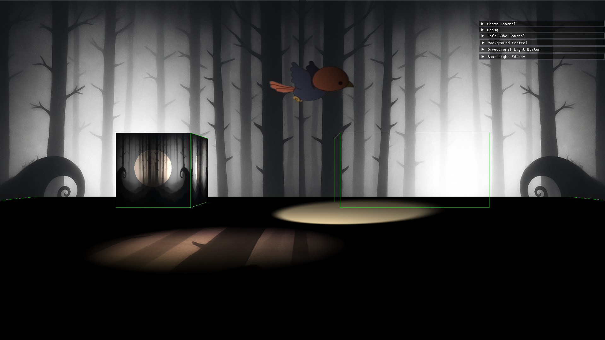

# EntityUnknown: A 2.5D Game in the Making (WIP)



> **EntityUnknown** is a **from-scratch 2.5D game** written in **C++20**, using **DirectX 11** and the **Win32 API**, without any prebuilt engine or third-party framework.

---

## 🚧 Project Status: ~20–25% Complete

The technical foundation is well underway. This is **not a complete game** yet — but the core systems such as rendering, lighting, input, and texture pipelines are already built and tested.

---

## ✅ What's Done So Far

### 🪟 1. Windows System
- Built directly on raw **Win32 API**
- Custom **keyboard/mouse input**
  - Key states: `PressedOnce`, `Held`, `Released`
  - Raw mouse delta input with cursor locking/hiding

### 🔔 2. Event Bus System
- Custom **event-driven architecture**
- Decouples input/render/logic layers efficiently

### 🖼️ 3. Render System
- Organized into:
  - **2D Rendering Queue**
  - **3D Rendering Queue**
- Supports **dynamic vertex/index buffers** and multi-pass systems

### 🧵 4. Texture & Resource Management
- Custom **TGA loader**
  - RLE compressed + alpha transparency support
- LOD and mipmap generation included
- Smart texture binding with internal slot cache optimization

### 💡 5. Lighting System
- Supports:
  - **Directional**, **Point**, and **Spot** lights
- Per-object **LightBuffer** selection (max N per type)
- Fully GPU-driven light data buffers

### 🧪 6. Advanced Material System
- Multi-texture support per object:
  - **Albedo**, **Normal**, **Specular**, **Alpha**, **Height**, **AO**, **Emissive**, **Roughness**, **Metalness**, **Light Map**
- Runtime material flags via constant buffers
- **TBN matrix support** and world-space lighting

### 🕹️ 7. Sprite & Animation System
- 3 Sprite Modes:
  - World-space sprite
  - Screen-space UI sprite (unlit)
  - Screen-space sprite with lighting
- Sprite animation support with frame-based timing control

### 🧩 8. Shader Infrastructure
- Modular shader system
- Shader constant buffers and GPU bindings controlled by metadata
- Simple lighting and material pipelines in HLSL

### 🧪 9. ImGui Debug UI (WIP)
- Integrated ImGui panels for:
  - Real-time object inspection
  - Light editing and toggles
  - Texture visualization

---

## 🔜 Planned Features

- 🗺️ **Level Editor**
  - Drag-drop objects, live transform, save/load to disk
- 🎛️ **Responsive UI System**
  - Main menu, pause menu, health bars
- 💾 **Save/Load Support**
  - JSON-style game state persistence
- ☁️ **Shadow Mapping**
  - Real-time shadows for directional/point/spot lights
  - Multiple light source support
  - Soft shadows and PCF

---

## 🧱 Tech Stack

| Subsystem        | Technology     |
|------------------|----------------|
| Language         | C++20          |
| Platform         | Windows 10/11  |
| Windowing        | Win32 API      |
| Renderer         | DirectX 11     |
| Input            | Raw WM_INPUT   |
| UI Layer         | ImGui (partial)|
| Texture Format   | TGA (custom loader) |
| Shader Language  | HLSL (SM5.0+)  |

---

## 🧰 Build Instructions

### Requirements:
- Windows 10/11
- Visual Studio 2022+
- Windows SDK with DirectX 11
- C++20 enabled

### Building:
```bash
git clone https://github.com/shrutibarar08/EntityUnknown.git
cd EntityUnknown
# Open EntityUnknown.sln in Visual Studio
# Set startup project and hit Build & Run
