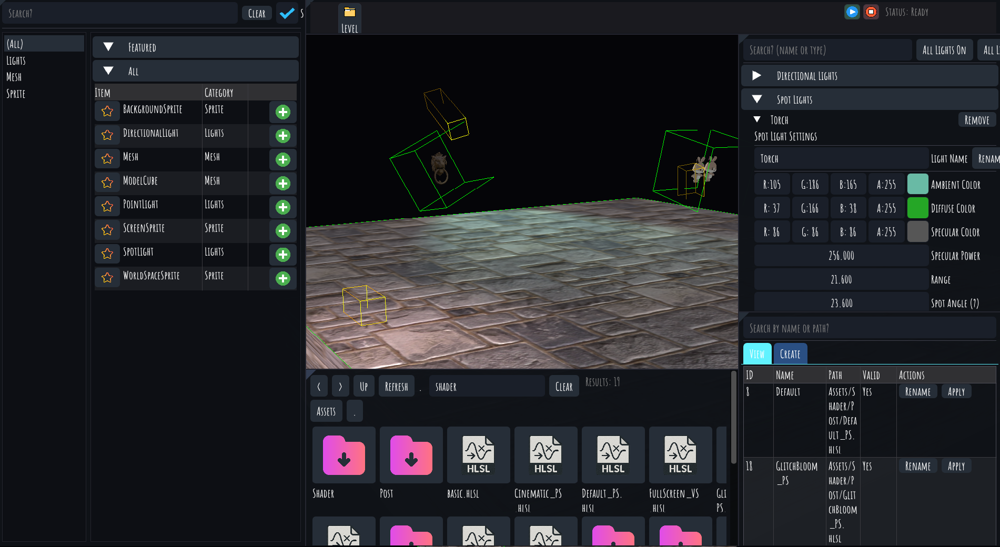

# EntityUnknown



**EntityUnknown** is a small, from-scratch **render engine** written in **C++20** on **DirectX 11** and **Win32** for a game I will be making called "EnitityUnknown".  
It’s a focused sandbox for experimenting with real-time computer graphics techniques, materials, lighting, render targets, and post-processing with minimal dependencies. The project is under active development.

> **Build note:** This is a Visual Studio **Community 2022** project.  
> **Release** currently has configuration issues — please use the **Debug** build for now.

---

## Current Scope

- Lightweight rendering framework for testing graphics features.
- **Material system** with common PBR-style maps:
  - Albedo, Normal, Roughness, Metalness, AO, Emissive, Height, Specular, Alpha, Light Map.
- **Lighting**
  - Directional, Point, and Spot lights (GPU structured buffers).
- **Geometry & shading**
  - TBN pipeline for normal mapping; world-space lighting.
- **Post-processing**
  - Pluggable effects (e.g., passthrough, toon/cinematic tests).
- **Model ingestion**
  - OBJ (custom loader).
  - glTF 2.0 (via `cgltf`, single-mesh path supported).
- **Render targets**
  - Flexible offscreen pipeline via `EURenderTarget` (color/depth, SRV, shadow-map ready).
- **Debug & tools**
  - ImGui runtime panels (object/material/light inspection).
  - Simple resource hot-rebind workflow.

---

## Editor Architecture (Policy-Based)

The editor layer is **policy-based**, making it easy to swap or extend behavior without touching core systems:

- **Header/Menu Policy** (e.g., `EngineHeaderPolicy`): controls top bar layout, menus, and actions.
- **Storage/Serialization Policy**: replace save/load backends (JSON, custom binary, etc.).
- **Level/Scene Policy**: customize level management, creation, deletion, and activation.
- **Rendering/UI Policies**: plug in alternate inspectors, panels, or tool layouts.

Each policy defines a small, focused interface and is wired through a central `LevelEditorContext`, so you can **replace individual policies** or add new ones with minimal coupling.

---

## Technology

| Subsystem   | Tech                                                       |
|-------------|------------------------------------------------------------|
| Language    | C++20                                                      |
| Platform    | Windows 10/11                                              |
| Windowing   | Win32 API                                                  |
| Renderer    | DirectX 11                                                 |
| Shaders     | HLSL (Shader Model 5.0+)                                   |
| Debug UI    | Dear ImGui                                                 |
| Assets      | Custom TGA loader, **stb_image**, glTF (`cgltf`), OBJ      |
| Build       | Visual Studio 2022 (Community)                             |

---

## Build Instructions

### Requirements
- **Visual Studio 2022 Community** (or newer)
- Windows 10/11 SDK with DirectX 11 components
- C++20 toolset enabled

### Steps
1. Clone the repository:
   ```bash
   git clone https://github.com/shrutibarar08/EntityUnknown.git
   cd EntityUnknown
